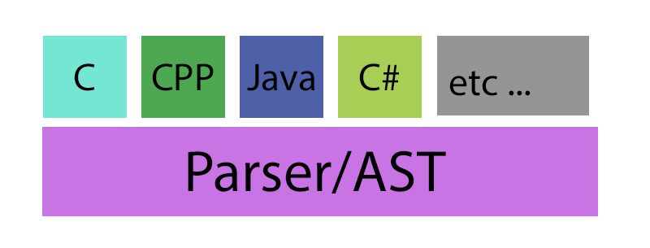

[](https://www.gnu.org/licenses/gpl-3.0)
[](https://melpa.org/#/parse-it)
[](https://stable.melpa.org/#/parse-it)

# parse-it
> Basic Parser in Emacs Lisp.


For most of the `major-mode` that needed a parser to act correctly. This is
a regular expression base parser. The goal of this project is to generate AST for
targeting programming language.

## Supported Langauges

* ActionScript - `actionscript`
* Assembly Language - `asm`
* C - `c`
* C++ - `c++`
* C# - `csharp`
* CSS - `css`
* Emacs Lisp - `elisp`
* Go - `go`
* HTML - `html`
* JSON - `json`
* Java - `java`
* JavaScript - `js`
* Kotlin - `kotlin`
* Lisp - `lisp`
* Lua - `lua`
* Markdown - `markdown`
* Objective-C - `objc`
* PHP - `php`
* Python - `python`
* R - `r`
* SQL - `sql`
* Swift - `swift`
* TypeScript - `typescript`
* XML - `xml`

## Try it yourself!

You can simply test with any script like the code under.

```el
(require 'parse-it)
(parse-it-util--print-ast-tree (parse-it 'typescript "path/to/file.ts"))
```

All tokens are listed under programming language's file itself.

## How to write one parser/AST for your favorite language?

There are 4 files you need to know before you write your own parser/AST.
And these 4 files are listed under below.

<p align="center">
  
</p>

1. `parse-it.el` - Entry.
2. `parse-it-lex.el` - Lexer functionalities.
3. `parse-it-ast.el` - Build AST after lexing.
4. `parse-it-uitl` - Other helpers.

Other file than these files are the implementation for specific programming
language due to their filename. For instance, `parse-it-c.el` is for programming
language `C`. If you are trying to implement c-like programming language you should check
out `parse-it-c.el` and reuse those identifier regular expression within that
file.

## Contribute

[](http://makeapullrequest.com)
[](https://github.com/bbatsov/emacs-lisp-style-guide)
[](https://www.paypal.me/jcs090218)
[](https://www.patreon.com/jcs090218)

If you would like to contribute to this project, you may either
clone and make pull requests to this repository. Or you can
clone the project and establish your own branch of this tool.
Any methods are welcome!
